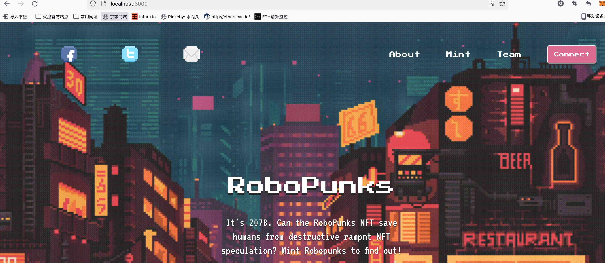

# Basic Sample Hardhat Project

## 项目初始化步骤：
    1.通过 npx create-react-app full-mint-website 构建基础的项目结构

    2.npm i -D hardhat

    3.通过 npx hardhat 构建默认的hardhat项目；

    4.npm i -D @openzeppelin/contracts 用于在编写solidity时使用openzeppelin封装好的合约

## 领取rinkeby测试网络ETH水龙头地址：
https://faucets.chain.link/rinkeby [可用，推荐]
https://fauceth.komputing.org/
https://faucet.rinkeby.io/

## 在infura上创建应用，并Endpoints类型设置为rinkeby
https://infura.io/dashboard

## hardhat部署的相关命令：
    1.npx hardhat clean  --清理

    2.npx hardhat compile --编译

    编译后的合约存储在：artifacts/contracts/RoboPunksNFT.sol/RoboPunksNFT.json

    3.npx hardhat run scripts/deploy_RoboPunksNFT.js --network rinkeby
    在部署的时候需要自己的账户中有ETH
    部署运行的基本思路：
    scripts/deploy_RoboPunksNFT.js 会调用本地配置hardhat.config.js中的配置进行部署

    network参数的指定是在hardhat.config.js中进行配置的，可以在hardhat.config.js中配置多个network，通过--network参数进行指定

    4.npx hardhat verify --network rinkeby 合约地址
    上面的命令的目的是为了再次验证我们的合约，然后再etherscan.io上找到合约时，能够看到contract中的代码和对应的方法。

```shell
npx hardhat accounts
npx hardhat compile
npx hardhat clean
npx hardhat test
npx hardhat node
node scripts/sample-script.js
npx hardhat help
```

## 最终运行效果


## 学习交流
学习web3和区块链的小伙伴，可以加qq: 285861181 ，共同交流。